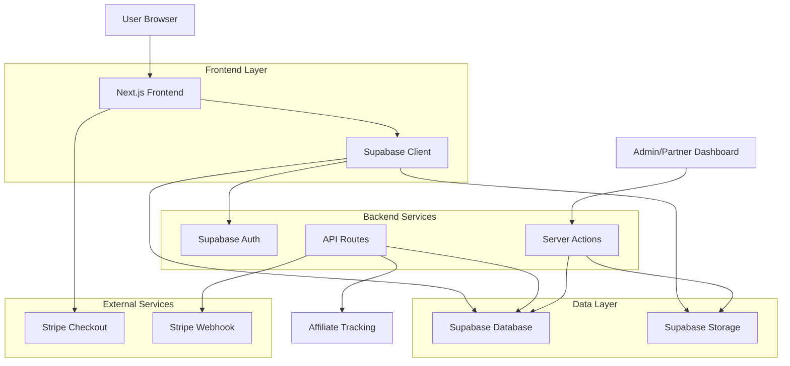
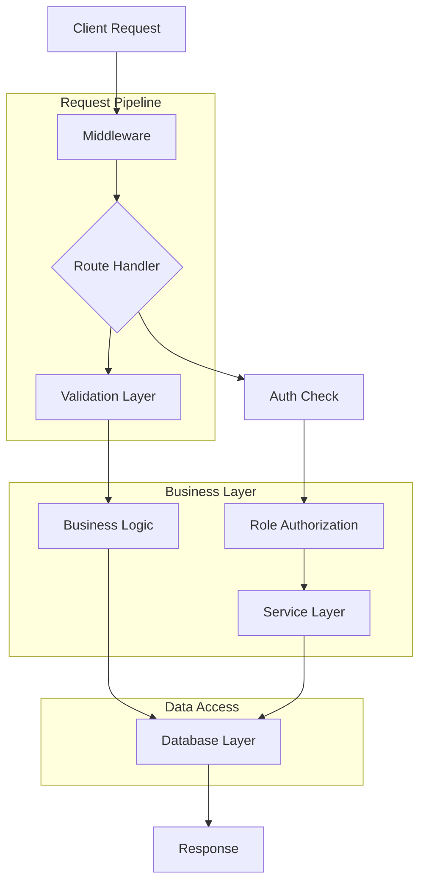
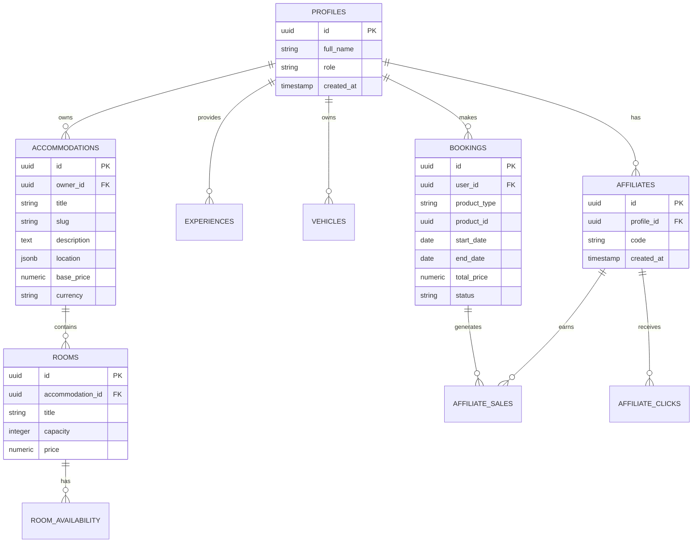

## 1. Arquitetura do Sistema



## 2. Stack Tecnológica

### Frontend
- **Framework:** Next.js 14+ (App Router)
- **Linguagem:** TypeScript 5+
- **Estilização:** TailwindCSS 3+ com Shadcn/UI
- **Animações:** Framer Motion
- **Validação:** Zod
- **Internacionalização:** next-intl
- **HTTP Client:** Supabase Client

### Backend & Infraestrutura
- **BaaS:** Supabase (PostgreSQL, Auth, Storage)
- **Pagamentos:** Stripe (Checkout + Webhooks)
- **Rate Limiting:** Upstash Redis (opcional)
- **Hospedagem:** Vercel
- **Analytics:** Sentry (opcional)

### Ferramentas de Desenvolvimento
- **Build:** Vite (via Next.js)
- **Linting:** ESLint + Prettier
- **Testes:** Jest + Testing Library + Playwright
- **Type Checking:** TypeScript strict mode

## 3. Definições de Rotas

### Rotas Públicas
| Rota | Propósito |
|------|-----------|
| `/` | Homepage com busca e destaques |
| `/search` | Página de busca com filtros |
| `/pousadas/[slug]` | Detalhes de acomodação |
| `/passeios/[slug]` | Detalhes de experiência |
| `/checkout` | Processo de checkout |
| `/auth/login` | Login de usuários |
| `/auth/signup` | Cadastro de novos usuários |
| `/auth/forgot` | Recuperação de senha |

### Rotas de Dashboard
| Rota | Propósito |
|------|-----------|
| `/dashboard/client` | Dashboard do cliente |
| `/dashboard/partner` | Dashboard do parceiro |
| `/dashboard/affiliate` | Dashboard do afiliado |
| `/dashboard/admin` | Dashboard administrativo |

### Rotas de API
| Rota | Propósito |
|------|-----------|
| `/api/bookings` | CRUD de reservas |
| `/api/affiliates/track` | Tracking de cliques de afiliados |
| `/api/stripe/webhook` | Webhook do Stripe |
| `/api/search` | Busca de produtos |

## 4. Definições de API

### 4.1 Autenticação

**POST /api/auth/login**
```typescript
// Request
interface LoginRequest {
  email: string;
  password: string;
  csrfToken: string;
}

// Response
interface LoginResponse {
  user: User;
  session: Session;
  redirectTo?: string;
}
```

**POST /api/auth/signup**
```typescript
// Request
interface SignupRequest {
  email: string;
  password: string;
  fullName: string;
  role: 'client' | 'partner';
  csrfToken: string;
}

// Response
interface SignupResponse {
  user: User;
  session: Session;
  requiresEmailVerification: boolean;
}
```

### 4.2 Reservas

**POST /api/bookings**
```typescript
// Request
interface CreateBookingRequest {
  productType: 'accommodation' | 'experience' | 'vehicle';
  productId: string;
  startDate: string;
  endDate?: string;
  guestCount: number;
  affiliateCode?: string;
  csrfToken: string;
}

// Response
interface CreateBookingResponse {
  bookingId: string;
  checkoutUrl: string;
  totalPrice: number;
  currency: string;
}
```

### 4.3 Afiliados

**GET /api/affiliates/track**
```typescript
// Query Parameters
interface TrackAffiliateParams {
  code: string;
  path?: string;
}

// Response
interface TrackAffiliateResponse {
  success: boolean;
  clickId: string;
}
```

## 5. Arquitetura do Servidor



## 6. Modelo de Dados

### 6.1 Diagrama ER



### 6.2 Definições de Tabelas

**Tabela: profiles**
```sql
CREATE TABLE profiles (
    id UUID REFERENCES auth.users(id) ON DELETE CASCADE PRIMARY KEY,
    full_name TEXT,
    role TEXT DEFAULT 'client' CHECK (role IN ('client', 'partner', 'affiliate', 'admin')),
    phone TEXT,
    document TEXT,
    created_at TIMESTAMPTZ DEFAULT NOW(),
    updated_at TIMESTAMPTZ DEFAULT NOW()
);
```

**Tabela: accommodations**
```sql
CREATE TABLE accommodations (
    id UUID PRIMARY KEY DEFAULT gen_random_uuid(),
    owner_id UUID REFERENCES profiles(id) ON DELETE CASCADE,
    title TEXT NOT NULL,
    slug TEXT UNIQUE NOT NULL,
    description TEXT,
    location JSONB,
    base_price NUMERIC(10,2) NOT NULL,
    currency TEXT DEFAULT 'BRL',
    images TEXT[],
    amenities TEXT[],
    created_at TIMESTAMPTZ DEFAULT NOW(),
    updated_at TIMESTAMPTZ DEFAULT NOW()
);
```

**Tabela: bookings**
```sql
CREATE TABLE bookings (
    id UUID PRIMARY KEY DEFAULT gen_random_uuid(),
    user_id UUID REFERENCES profiles(id) ON DELETE CASCADE,
    product_type TEXT NOT NULL CHECK (product_type IN ('accommodation', 'experience', 'vehicle')),
    product_id UUID NOT NULL,
    start_date DATE NOT NULL,
    end_date DATE,
    guest_count INTEGER DEFAULT 1,
    total_price NUMERIC(10,2) NOT NULL,
    currency TEXT DEFAULT 'BRL',
    status TEXT DEFAULT 'pending' CHECK (status IN ('pending', 'confirmed', 'cancelled', 'completed')),
    stripe_session_id TEXT,
    created_at TIMESTAMPTZ DEFAULT NOW(),
    updated_at TIMESTAMPTZ DEFAULT NOW()
);
```

## 7. Configurações de Segurança

### 7.1 Variáveis de Ambiente
```bash
# Supabase
NEXT_PUBLIC_SUPABASE_URL=https://your-project.supabase.co
NEXT_PUBLIC_SUPABASE_ANON_KEY=your-anon-key
SUPABASE_SERVICE_ROLE_KEY=your-service-role-key

# Stripe
NEXT_PUBLIC_STRIPE_PUBLISHABLE_KEY=pk_test_...
STRIPE_SECRET_KEY=sk_test_...
STRIPE_WEBHOOK_SECRET=whsec_...

# Vercel
NEXT_PUBLIC_VERCEL_URL=https://your-app.vercel.app

# Rate Limiting (Opcional)
UPSTASH_REDIS_REST_URL=https://your-redis.upstash.io
UPSTASH_REDIS_REST_TOKEN=your-redis-token
```

### 7.2 Headers de Segurança
```typescript
// middleware.ts
const securityHeaders = {
  'X-Frame-Options': 'DENY',
  'X-Content-Type-Options': 'nosniff',
  'Referrer-Policy': 'strict-origin-when-cross-origin',
  'X-XSS-Protection': '1; mode=block',
  'Strict-Transport-Security': 'max-age=31536000; includeSubDomains',
  'Content-Security-Policy': "default-src 'self'; script-src 'self' 'unsafe-inline' https://js.stripe.com; style-src 'self' 'unsafe-inline'; img-src 'self' data: https:; connect-src 'self' https://api.stripe.com https://your-project.supabase.co; frame-src https://js.stripe.com https://hooks.stripe.com;"
};
```

## 8. Sistema de Afiliados

### 8.1 Rastreamento de Cliques
```typescript
// /api/affiliates/track/route.ts
export async function GET(request: Request) {
  const { searchParams } = new URL(request.url);
  const code = searchParams.get('code');
  const path = searchParams.get('path') || '/';
  
  // Validar código do afiliado
  const { data: affiliate } = await supabase
    .from('affiliates')
    .select('id, profile_id')
    .eq('code', code)
    .single();
    
  if (affiliate) {
    // Registrar clique
    await supabase.from('affiliate_clicks').insert({
      affiliate_id: affiliate.id,
      path,
      ip: request.headers.get('x-forwarded-for'),
      user_agent: request.headers.get('user-agent')
    });
    
    // Set cookie por 30 dias
    cookies().set('affiliate_code', code, {
      maxAge: 60 * 60 * 24 * 30,
      sameSite: 'lax',
      secure: process.env.NODE_ENV === 'production'
    });
  }
  
  // Redirecionar para o path original
  return NextResponse.redirect(new URL(path, request.url));
}
```

### 8.2 Cálculo de Comissões
```typescript
// lib/commissions.ts
export async function calculateCommission(
  bookingId: string,
  affiliateCode: string,
  totalPrice: number
): Promise<number> {
  // Buscar configuração de comissão
  const { data: commission } = await supabase
    .from('commissions')
    .select('default_percent')
    .eq('product_type', productType)
    .single();
    
  const commissionRate = commission?.default_percent || 0.05; // 5% default
  return totalPrice * commissionRate;
}
```

## 9. Integração com Stripe

### 9.1 Criação de Sessão de Checkout
```typescript
// lib/stripe.ts
export async function createCheckoutSession(
  booking: Booking,
  affiliateCode?: string
): Promise<string> {
  const session = await stripe.checkout.sessions.create({
    payment_method_types: ['card'],
    line_items: [
      {
        price_data: {
          currency: booking.currency.toLowerCase(),
          product_data: {
            name: booking.product_name,
            images: [booking.product_image],
          },
          unit_amount: Math.round(booking.total_price * 100),
        },
        quantity: 1,
      },
    ],
    mode: 'payment',
    success_url: `${process.env.NEXT_PUBLIC_VERCEL_URL}/checkout/success?session_id={CHECKOUT_SESSION_ID}`,
    cancel_url: `${process.env.NEXT_PUBLIC_VERCEL_URL}/checkout/cancel?booking_id=${booking.id}`,
    metadata: {
      booking_id: booking.id,
      affiliate_code: affiliateCode || '',
      product_type: booking.product_type,
      product_id: booking.product_id,
    },
  });
  
  return session.url;
}
```

### 9.2 Webhook de Stripe
```typescript
// /api/stripe/webhook/route.ts
export async function POST(request: Request) {
  const body = await request.text();
  const signature = request.headers.get('stripe-signature');
  
  let event;
  try {
    event = stripe.webhooks.constructEvent(
      body,
      signature,
      process.env.STRIPE_WEBHOOK_SECRET
    );
  } catch (err) {
    return NextResponse.json({ error: 'Invalid signature' }, { status: 400 });
  }
  
  switch (event.type) {
    case 'checkout.session.completed':
      const session = event.data.object;
      await handleSuccessfulPayment(session);
      break;
      
    case 'payment_intent.payment_failed':
      const paymentIntent = event.data.object;
      await handleFailedPayment(paymentIntent);
      break;
  }
  
  return NextResponse.json({ received: true });
}
```

## 10. Internacionalização (i18n)

### 10.1 Estrutura de Traduções
```
/i18n
  /locales
    /pt-BR
      common.json
      home.json
      dashboard.json
    /es-ES
      common.json
      home.json
      dashboard.json
    /en-US
      common.json
      home.json
      dashboard.json
```

### 10.2 Configuração de Locale
```typescript
// middleware.ts
import createMiddleware from 'next-intl/middleware';

export default createMiddleware({
  locales: ['pt-BR', 'es-ES', 'en-US'],
  defaultLocale: 'pt-BR',
  localePrefix: 'always',
});

export const config = {
  matcher: ['/((?!api|_next|.*\\..*).*)']
};
```

## 11. Testes e Qualidade

### 11.1 Testes Unitários
```typescript
// __tests__/lib/commissions.test.ts
describe('Commission Calculation', () => {
  it('should calculate 5% commission for accommodation', () => {
    const totalPrice = 1000;
    const commissionRate = 0.05;
    const expectedCommission = 50;
    
    const result = calculateCommission(totalPrice, commissionRate);
    expect(result).toBe(expectedCommission);
  });
  
  it('should handle zero commission rate', () => {
    const totalPrice = 1000;
    const commissionRate = 0;
    
    const result = calculateCommission(totalPrice, commissionRate);
    expect(result).toBe(0);
  });
});
```

### 11.2 Testes E2E
```typescript
// e2e/booking-flow.spec.ts
test('complete booking flow', async ({ page }) => {
  // Visit homepage
  await page.goto('/');
  
  // Search for accommodation
  await page.fill('[data-testid="search-input"]', 'Rio de Janeiro');
  await page.click('[data-testid="search-button"]');
  
  // Select first result
  await page.click('[data-testid="product-card"]:first-child');
  
  // Select dates
  await page.click('[data-testid="calendar-start-date"]');
  await page.click('[data-testid="date-available"]:first-child');
  
  // Proceed to checkout
  await page.click('[data-testid="book-now-button"]');
  
  // Complete payment
  await page.fill('[data-testid="stripe-card-number"]', '4242424242424242');
  await page.click('[data-testid="pay-button"]');
  
  // Verify success
  await expect(page.locator('[data-testid="booking-success"]')).toBeVisible();
});
```

## 12. Deploy e Configuração

### 12.1 Configuração do Vercel
```json
// vercel.json
{
  "buildCommand": "next build",
  "outputDirectory": ".next",
  "framework": "nextjs",
  "regions": ["gru1"],
  "functions": {
    "app/api/stripe/webhook/route.ts": {
      "maxDuration": 30
    }
  },
  "rewrites": [
    {
      "source": "/api/stripe/webhook",
      "destination": "/api/stripe/webhook"
    }
  ],
  "headers": [
    {
      "source": "/(.*)",
      "headers": [
        {
          "key": "X-Content-Type-Options",
          "value": "nosniff"
        },
        {
          "key": "Referrer-Policy",
          "value": "strict-origin-when-cross-origin"
        }
      ]
    }
  ]
}
```

### 12.2 Scripts de Deploy
```bash
# package.json
{
  "scripts": {
    "dev": "next dev",
    "build": "next build",
    "start": "next start",
    "lint": "next lint",
    "test": "jest",
    "test:e2e": "playwright test",
    "db:generate-types": "supabase gen types typescript --project-id your-project > types/supabase.ts",
    "db:migrate": "supabase migration up",
    "db:seed": "tsx scripts/seed.ts"
  }
}
```

## 13. Checklist de Segurança

### 13.1 Configurações Obrigatórias
- [ ] HTTPS forçado com HSTS
- [ ] CSP configurado e testado
- [ ] Cookies com secure, httponly, samesite
- [ ] RLS ativado em todas as tabelas
- [ ] Rate limiting implementado
- [ ] Validação de webhook do Stripe
- [ ] Sanitização de inputs com Zod
- [ ] Headers de segurança configurados
- [ ] Logs de segurança implementados
- [ ] Backup automativo configurado

### 13.2 Testes de Segurança
- [ ] Teste de injeção SQL
- [ ] Teste de XSS
- [ ] Teste de CSRF
- [ ] Teste de rate limiting
- [ ] Teste de autenticação
- [ ] Teste de autorização por role
- [ ] Teste de validação de inputs
- [ ] Teste de upload de arquivos
- [ ] Teste de acesso não autorizado
- [ ] Teste de vazamento de dados sensíveis

## 14. Monitoramento e Manutenção

### 14.1 Logs e Analytics
```typescript
// lib/logger.ts
export function logSecurityEvent(
  eventType: string,
  userId?: string,
  metadata?: Record<string, any>
) {
  supabase.from('security_events').insert({
    event_type: eventType,
    user_id: userId,
    ip: headers().get('x-forwarded-for'),
    user_agent: headers().get('user-agent'),
    meta: metadata
  });
}
```

### 14.2 Métricas de Performance
- Tempo de carregamento das páginas
- Taxa de conversão de reservas
- Tempo de resposta da API
- Taxa de erros por endpoint
- Uso de banda e storage
- Performance do banco de dados
- Taxa de sucesso de pagamentos

Este documento serve como guia completo para implementação do RedeTour MVP e deve ser