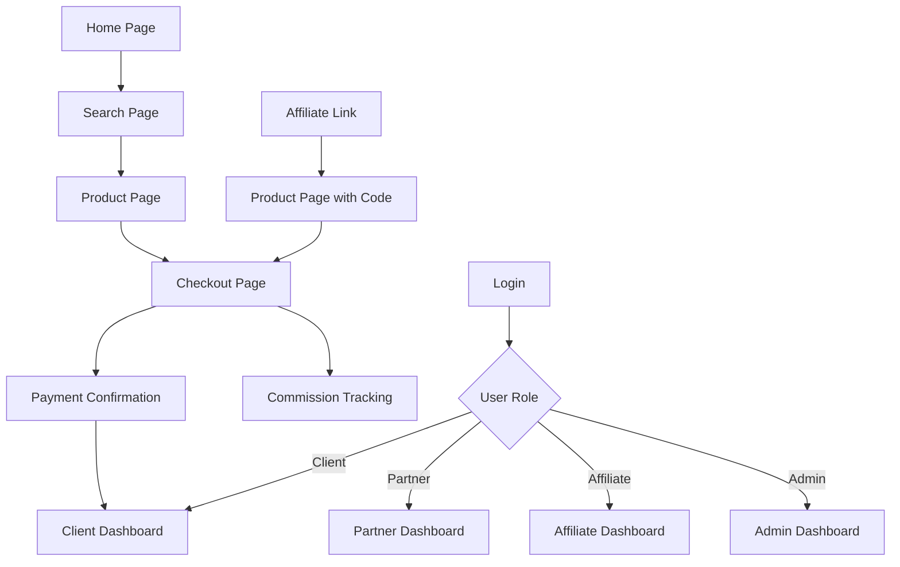

## 1. Visão Geral do Produto

RedeTour é uma plataforma web de turismo e hospedagem que conecta viajantes com pousadas, experiências e serviços de transporte. O MVP foca em oferecer um marketplace simples com sistema de afiliados, permitindo que parceiros promovam produtos turísticos e ganhem comissões.

**Problema resolvido:** Centralizar a oferta turística local em uma plataforma digital com sistema de indicações e comissões automatizadas.

**Público-alvo:** Viajantes, pousadas, guias turísticos, afiliados e administradores da plataforma.

**Valor de mercado:** Facilitar a descoberta e reserva de experiências turísticas locais com incentivo econômico para promotores.

## 2. Funcionalidades Principais

### 2.1 Papéis de Usuário

| Papel | Método de Registro | Permissões Principais |
|-------|-------------------|----------------------|
| Cliente | Registro por email | Buscar, visualizar e reservar produtos |
| Parceiro | Aprovação manual | Criar/editar acomodações, experiências e veículos |
| Afiliado | Auto-registro com código | Gerar links de indicação, ver comissões |
| Admin | Registro manual | Gerenciar usuários, aprovar parceiros, configurar comissões |

### 2.2 Módulos de Funcionalidades

O MVP RedeTour consiste nas seguintes páginas principais:

1. **Página Inicial:** Busca principal, cards de destaque, navegação por categorias
2. **Página de Busca:** Filtros por tipo, preço, localização, disponibilidade
3. **Página de Produto:** Detalhes do produto, galeria de fotos, calendário de disponibilidade
4. **Página de Checkout:** Resumo da reserva, formulário de pagamento, confirmação
5. **Autenticação:** Login, cadastro, recuperação de senha, link mágico
6. **Dashboard Cliente:** Minhas reservas, favoritos, perfil, histórico
7. **Dashboard Parceiro:** CRUD de produtos, reservas recebidas, financeiro
8. **Dashboard Afiliado:** Estatísticas de indicações, comissões, links promocionais
9. **Dashboard Admin:** Gerenciamento de usuários, aprovações, configurações

### 2.3 Detalhamento das Páginas

| Página | Módulo | Descrição das Funcionalidades |
|--------|--------|-------------------------------|
| Home | Hero Search | Campo de busca principal com autocomplete e filtros rápidos |
| Home | Featured Cards | Cards responsivos mostrando produtos em destaque |
| Home | Navigation | Menu superior com links para dashboards e categorias |
| Busca | Filters Panel | Painel lateral com filtros por preço, tipo, disponibilidade |
| Busca | Results Grid | Grid de cards com paginação e ordenação |
| Produto | Gallery | Carrossel de imagens com zoom e navegação por thumbnails |
| Produto | Details | Informações completas do produto, preços, disponibilidade |
| Produto | Booking Calendar | Calendário interativo para seleção de datas |
| Checkout | Summary | Resumo da reserva com valores e detalhes |
| Checkout | Payment | Integração com Stripe para pagamento seguro |
| Checkout | Confirmation | Página de sucesso com detalhes da reserva |
| Auth | Login | Formulário de login com validação e link mágico |
| Auth | Signup | Cadastro com verificação de email |
| Auth | Forgot | Recuperação de senha por email |
| Client Dashboard | Bookings | Lista de reservas com status e ações |
| Client Dashboard | Profile | Edição de perfil e preferências |
| Partner Dashboard | Products | CRUD completo para produtos com upload de imagens |
| Partner Dashboard | Bookings | Gerenciamento de reservas recebidas |
| Affiliate Dashboard | Stats | Gráficos de cliques, conversões e comissões |
| Affiliate Dashboard | Links | Gerador de links de afiliado com código único |
| Admin Dashboard | Users | Gerenciamento de todos os usuários |
| Admin Dashboard | Approvals | Aprovação de novos parceiros |
| Admin Dashboard | Commissions | Configuração de percentuais de comissão |

## 3. Fluxos Principais

### Fluxo do Cliente
1. Usuário acessa a home e realiza busca
2. Visualiza resultados e seleciona produto
3. Escolhe datas e quantidade no calendário
4. Procede para checkout e realiza pagamento
5. Recebe confirmação e acesso ao dashboard

### Fluxo do Parceiro
1. Parceiro se cadastra e aguarda aprovação
2. Após aprovação, cria seus produtos com imagens
3. Configura disponibilidade e preços
4. Gerencia reservas recebidas
5. Acompanha financeiro e relatórios

### Fluxo do Afiliado
1. Afiliado gera código único de indicação
2. Compartilha links com seu código
3. Sistema registra cliques e conversões
4. Comissões são calculadas automaticamente
5. Afiliado solicita saque de comissões

### Fluxo do Admin
1. Admin acessa painel administrativo
2. Aprova/reprova solicitações de parceiros
3. Configura percentuais de comissão
4. Monitora atividade da plataforma
5. Gerencia usuários e permissões

## 4. Design da Interface

### 4.1 Estilo Visual

**Cores Principais:**
- Turquesa: #1BBFD9 (cor primária)
- Oceano: #006C8A (cor secundária)
- Marinho: #003245 (textos principais)
- Amarelo: #FFD76B (destaques e CTAs)
- Claro: #F4F7F8 (fundo e áreas neutras)

**Elementos de Design:**
- Botões: Estilo arredondado com sombras suaves
- Tipografia: Fonte sans-serif moderna (Inter ou similar)
- Layout: Baseado em cards com bordas arredondadas
- Ícones: Estilo outline minimalista
- Animações: Transições suaves com Framer Motion

### 4.2 Visão Geral das Páginas

| Página | Módulo | Elementos de UI |
|--------|--------|-----------------|
| Home | Hero Search | Barra de busca centralizada com gradiente de fundo turquesa |
| Home | Featured Cards | Cards com imagem, preço e avaliação em grid responsivo |
| Search | Filters | Sidebar colapsável com checkboxes e range sliders |
| Product | Gallery | Carrossel full-width com navegação por thumbnails |
| Product | Booking | Card de reserva sticky com calendário e botão CTA amarelo |
| Checkout | Forms | Formulários multi-step com progress indicator |
| Dashboard | Navigation | Sidebar com ícones e menu hierárquico |
| Dashboard | Tables | Tabelas com sorting, filtering e ações em dropdown |

### 4.3 Responsividade

- **Desktop-first:** Design otimizado para telas grandes (1920px+)
- **Mobile-adaptive:** Layout adaptativo para tablets (768px) e smartphones (375px)
- **Touch optimization:** Botões e links com área de toque mínima de 44px
- **Performance:** Imagens otimizadas com lazy loading e WebP
- **Acessibilidade:** Suporte para navegação por teclado e leitores de tela